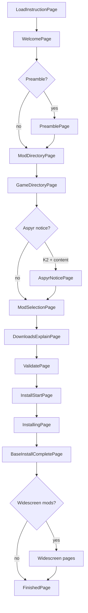

# Install lifecycle

`[REPO]` End-to-end install flow: install wizard page order, Core install orchestration, Git checkpoints, widescreen follow-up, and CLI parity. Validation is documented separately in [validation-pipeline.md](validation-pipeline.md).

Sources: `src/KOTORModSync.GUI/Dialogs/InstallWizardDialog.axaml.cs`, `src/KOTORModSync.GUI/Dialogs/WizardPages/InstallingPage.axaml.cs`, `src/KOTORModSync.Core/Services/InstallationService.cs`, `src/KOTORModSync.Core/Installation/InstallCoordinator.cs`.

## Install wizard page order

`[REPO]` Pages are registered in `InstallWizardDialog.InitializePages()`:

| # | Page | When shown |
|---|------|------------|
| 1 | `LoadInstructionPage` | Always |
| 2 | `WelcomePage` | Always |
| 3 | `PreamblePage` | When `MainConfig.preambleContent` is non-empty |
| 4 | `ModDirectoryPage` | Always |
| 5 | `GameDirectoryPage` | Always |
| 6 | `AspyrNoticePage` | K2/TSL when `aspyrExclusiveWarningContent` is set |
| 7 | `ModSelectionPage` | Always |
| 8 | `DownloadsExplainPage` | Always (downloads may continue in background) |
| 9 | `ValidatePage` | Always — uses `InstallationValidationPipeline` / `WizardFull` |
| 10 | `InstallStartPage` | Always |
| 11 | `InstallingPage` | Always — calls `InstallationService.InstallAllSelectedComponentsAsync` |
| 12 | `BaseInstallCompletePage` | Always |
| 13 | `FinishedPage` | Always (widescreen pages insert **before** this when needed) |

**Widescreen block** (`[UI]`): After base install completes, `AddWidescreenPages()` may insert (before `FinishedPage`) when any selected component has `WidescreenOnly`:

- `WidescreenNoticePage` (if `widescreenWarningContent` is set)
- `WidescreenModSelectionPage`
- `WidescreenInstallingPage`
- `WidescreenCompletePage`

There is no dedicated CLI widescreen flow — see [agent-action-parity.md](agent-action-parity.md).

**Legacy Getting Started** (`MainWindow` / `GettingStartedTab`) parallels directory pickers, **Fetch Downloads**, and **Validate** but does not replace the wizard install path for full-build testing. Agents should prefer the wizard + [local desktop runbook](../local_desktop_agent_runbook.md).

## Lifecycle diagram

## Real install (Core)

`[REPO]` **InstallingPage** and CLI `install` both drive **`InstallationService.InstallAllSelectedComponentsAsync`**:

1. **`InstallCoordinator.InitializeAsync`** — orders components, resumes checkpoint state, sets up **`GitCheckpointService`** on the game directory.
2. Loop **selected** components in install order (`component.IsSelected`).
3. Per component: **`ModComponent.InstallAsync`** executes instructions (real `RealFileSystemProvider`, not VFS). See [vfs-vs-real-fs.md](vfs-vs-real-fs.md).
4. On success: optional **Git checkpoint** commit via `CheckpointService.CreateCheckpointAsync`; checkpoint manager persists component state.
5. On failure: behavior depends on **`MainConfig`** continue flags (see below).

**Pre-install validation** (wizard **ValidatePage** or default CLI `install`) uses **`InstallationValidationPipeline`** with VFS dry-run — that is **not** the same code path as step 3. Do not treat a passing validate as proof that real HoloPatcher or disk edge cases are covered.

## Checkpoints

`[REPO]` **`InstallCoordinator`** owns **`GitCheckpointService`** for the KOTOR destination directory. After each successful component install, a checkpoint commit may be created; failures to checkpoint are logged as warnings and do not abort the install.

CLI: **`--no-checkpoint`** disables the checkpoint system (`ModBuildConverter` install options). Default is checkpoints **enabled**.

## Continue-on-failure flags

`[REPO]` `MainConfig` maps to CLI install flags:

| Behavior | MainConfig | CLI |
|----------|------------|-----|
| Skip missing archives, keep going | `ContinueInstallOnMissingSources` | `--continue-on-missing-sources` (included in `--best-effort`) |
| Continue after mod install failure | `ContinueInstallOnModFailure` | `--continue-on-mod-failure` (included in `--best-effort`) |
| Skip pre-install validation | (install path) | `--skip-validation` |
| Non-interactive install | — | `-y` / `--yes` |

**`--best-effort`** sets continue-on-missing-sources, continue-on-mod-failure, and `-y` together (`install_best_effort.sh` uses this for long headless full-list runs). Exit code may be **`CompletedWithFailures`** when installs continued after failures.

**Default `install`** (without those flags) stops the component loop on hard failure (except already-completed/skipped/blocked states).

## CLI vs GUI summary

| Step | GUI | CLI / scripts |
|------|-----|----------------|
| Load TOML | Wizard / preload `--instructionFile=` | `-i` / `--instruction-file` |
| Directories | Mod + game pages | `-s` / `-g` or `--modDirectory=` / `--kotorPath=` |
| Select mods | `ModSelectionPage` | `install` default all; `--select` for subset — [cli-selection-semantics.md](cli-selection-semantics.md) |
| Download | `DownloadsExplainPage` + legacy Fetch | `install -d` — [download-system.md](download-system.md) |
| Validate | `ValidatePage` | `validate` / `cli_validate.sh` |
| Install | `InstallingPage` | `install` |
| Widescreen | Dynamic wizard pages | No equivalent `[UI]` |

## Related docs

- [validation-pipeline.md](validation-pipeline.md) — five stages, `WizardFull`, fail-fast
- [agent-action-parity.md](agent-action-parity.md) — parity table
- [core-cli-reference.md](core-cli-reference.md) — full flag list
- [local desktop agent runbook](../local_desktop_agent_runbook.md) — preload args and wizard controls
