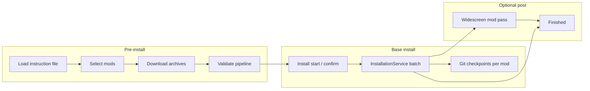

# Tier 2 workflow knowledgebase pages

## Summary

Add two agent-facing workflow pages deferred from Tier 1: **install lifecycle** (wizard → validate → install → widescreen → checkpoints) and **download system** (handlers, cache, CLI/GUI entry points). Update `docs/knowledgebase/README.md` with a “Workflows” subsection and read-order rows. Docs-only slice; no product code changes.

---

## Problem Frame

Tier 1 (`docs/plans/2026-05-30-001-feat-tier1-knowledgebase-pages-plan.md`) gave agents domain reference for TOML, components, and validation. Agents debugging **installs**, **downloads**, or **full-build GUI flows** still grep `InstallWizardDialog.axaml.cs`, `InstallationService.cs`, `DownloadCacheService.cs`, and `agent-action-parity.md` tables without a single narrative.

Runbooks (`docs/local_desktop_agent_runbook.md`) are procedural; parity docs are tabular. Tier 2 fills the **workflow semantics** gap between Tier 1 domain pages and runbooks.

---

## Requirements

- R1. `install-lifecycle.md` — end-to-end install phases: pre-install (load/select/download/validate), base install, optional widescreen pass, checkpoints, failure modes (`--best-effort`, `--skip-validation`), GUI vs CLI entry points.
- R2. `download-system.md` — `ResourceRegistry` URLs, handler chain, `DownloadCacheService`, Nexus API key, concurrent vs sequential, GUI surfaces vs CLI `-d` / `--download`.
- R3. Update `docs/knowledgebase/README.md` — “Workflows” topic index; read-order rows for install debugging and download/populating mod workspace.
- R4. Cross-link from `product-overview.md` and `agent-action-parity.md` (short pointers only; no full duplication).
- R5. Evidence labels and repo-relative links per existing KB convention; no absolute paths in examples.

---

## Scope Boundaries

**In scope**

- Two new KB pages + README + light cross-links (R1–R5).
- This plan file.

**Deferred to follow-up work**

- Tier 3 / architecture docs: `MainWindow` decomposition, `WizardHostControl` vs `InstallWizardDialog` duality, validation UI mapper extraction.
- `editor-mode.md` or GUI editor workflow page.
- Changes to `AGENTS.md`, `.cursorrules`, or generated maps (`ModSync_Master.md`).
- New automated tests (docs-only slice).

**Out of scope (non-goals)**

- Promising headless parity for widescreen install or live download status UI.
- Duplicating full CLI flag tables (link to `core-cli-reference.md`).

---

## Assumptions

- “etc.” from Tier 1 deferral means **install-lifecycle** and **download-system** only for this slice; real-install execution detail lives inside install-lifecycle (not a third page).
- `product-overview.md` and `agent-action-parity.md` get at most one paragraph + link each; parity tables stay authoritative for matrix lookups.

---

## Key Technical Decisions

- **Two pages, not one mega-doc** — install and download are separate agent task shapes (debugging failed patch vs missing archive).
- **Link, don’t duplicate** — Tier 1 (`validation-pipeline.md`, `vfs-vs-real-fs.md`, `cli-selection-semantics.md`) and runbooks remain canonical for depth; Tier 2 narrates sequencing and names Core/GUI types.
- **Widescreen and checkpoints** live under install-lifecycle (small subsections), not standalone pages.
- **Mermaid lifecycle diagram** in install-lifecycle for scanability (wizard + CLI parallel tracks).

---

## High-Level Technical Design

CLI can short-circuit GUI pages but hits the same Core services (`InstallationValidationPipeline`, `DownloadCacheService`, `InstallationService`) with documented gaps (widescreen, download status UI).

---

## Implementation Units

### U1. Install lifecycle page

**Goal:** Single narrative for “what happens from mod list to game directory” for agents.

**Requirements:** R1

**Files:**

- Create: `docs/knowledgebase/install-lifecycle.md`

**Approach:**

- **GUI wizard track:** Page order from `InstallWizardDialog.axaml.cs` / `AGENTS.md` (Load → … → Installing → BaseInstallComplete → dynamic widescreen → Finished). Note `DownloadsExplainPage` allows advancing while downloads continue `[UI]`.
- **Legacy Getting Started track:** Brief pointer to parallel tab flow (directories, Fetch Downloads, Validate) — link runbook, don’t duplicate steps.
- **Core install path:** `InstallationService.InstallAllSelectedComponentsAsync`, `ModComponent.InstallAsync`, `InstallCoordinator` + `GitCheckpointService` / `--no-checkpoint` CLI flag. Contrast with validation: real FS writes `[REPO]` (see `vfs-vs-real-fs.md`).
- **Widescreen:** Dynamic pages after base install; per-mod `InstallSingleComponentAsync` in `WidescreenInstallingPage`; **no CLI equivalent** — cite `agent-action-parity.md`.
- **Failure / agent flags:** `--best-effort`, `--skip-validation`, `CompletedWithFailures` behavior; link `cli-selection-semantics.md`.
- **Agent entry table:** GUI preload + runbook vs `cli_validate.sh` / `install` / `install_best_effort.sh`.

**Patterns to follow:** `docs/knowledgebase/validation-pipeline.md`, `docs/knowledgebase/product-overview.md`

**Test expectation:** none — documentation only

**Verification:** All wizard pages named; widescreen gap explicit; checkpoint + `--no-checkpoint` documented; links to Tier 1 validation/VFS pages resolve.

---

### U2. Download system page

**Goal:** Explain how archives get from URLs into `<<modDirectory>>` for agents populating mod workspace or debugging fetch failures.

**Requirements:** R2

**Files:**

- Create: `docs/knowledgebase/download-system.md`

**Approach:**

- **Data model:** `ModComponent.ResourceRegistry` (URL → expected filename); relationship to instruction archives.
- **Handler chain:** Order from `DownloadHandlerFactory.cs` (DeadlyStream → Mega → Nexus → GameFront → DirectDownload fallback). One-line role per handler.
- **Orchestration:** `DownloadManager`, `DownloadCacheService.ResolveOrDownloadAsync`, temp vs `MainConfig.SourcePath` / `--source-dir`.
- **CLI:** `install -d` / `convert -d`, `--concurrent`, `--download-timeout-hours`, Nexus env vars — link `core-cli-reference.md` for full flag list.
- **GUI:** `DownloadCacheService` on `MainWindow`, `ScrapeDownloadsButton`, wizard `DownloadsExplainPage`, `SingleModDownloadDialog`, editor `DownloadLinksControl` — note status UI is GUI-only `[UI]`.
- **Operational notes:** Nexus key required for many full-build URLs; `install_best_effort.sh` placeholder key pattern from parity doc; cache/history behavior at high level (point to `DownloadCacheService.cs` for detail).

**Patterns to follow:** `docs/knowledgebase/core-cli-reference.md`, `docs/knowledgebase/mod-builds-sources.md`

**Test expectation:** none — documentation only

**Verification:** Handler order matches factory; CLI and GUI entry points listed; no promise of CLI download progress parity.

---

### U3. Knowledgebase index and read-order

**Goal:** Discoverability from KB README.

**Requirements:** R3

**Dependencies:** U1, U2

**Files:**

- Modify: `docs/knowledgebase/README.md`

**Approach:**

- Add **Workflows** subsection under topic index with install-lifecycle + download-system.
- Extend read-order table:
  - “Running or debugging install” → `install-lifecycle.md` → runbook / `agent-action-parity.md`
  - “Populating mod workspace / download failures” → `download-system.md` → `mod-builds-sources.md`

**Test expectation:** none — documentation only

**Verification:** All new pages linked; existing Tier 1 links unchanged.

---

### U4. Light cross-links from Tier 1 / parity docs

**Goal:** Route agents from overview and parity matrix into Tier 2 without table bloat.

**Requirements:** R4

**Dependencies:** U1, U2

**Files:**

- Modify: `docs/knowledgebase/product-overview.md` (workflows table — add Tier 2 links)
- Modify: `docs/knowledgebase/agent-action-parity.md` (intro or install section — “see install-lifecycle / download-system”)

**Approach:** One sentence + markdown link each; no relocation of parity tables.

**Test expectation:** none — documentation only

**Verification:** `git diff --stat` limited to `docs/knowledgebase/*` and this plan.

---

## Verification

- Grep new/edited KB files for absolute paths outside placeholders (`<<modDirectory>>`, `<<kotorDirectory>>`).
- Confirm internal links resolve under `docs/knowledgebase/`.
- Manual spot-check: handler order in `download-system.md` matches `DownloadHandlerFactory.cs`.
- `git diff --stat` shows only knowledgebase docs + plan.

---

## Success Criteria

- Agent debugging install order, widescreen, or checkpoints can start at `install-lifecycle.md` without opening wizard source first.
- Agent debugging missing archives or Nexus failures can start at `download-system.md`.
- KB README lists Tier 2 pages and read-order rows for install and download tasks.
- Tier 1 pages remain the authority for TOML schema and validation stages; no contradictory claims.

---

## Sources and research

| Source | Use |
|--------|-----|
| `docs/plans/2026-05-30-001-feat-tier1-knowledgebase-pages-plan.md` | Deferred scope |
| `docs/knowledgebase/agent-action-parity.md` | Wizard order, parity gaps |
| `src/ModSync.GUI/Dialogs/InstallWizardDialog.axaml.cs` | Page sequence |
| `src/ModSync.Core/Services/InstallationService.cs` | Install orchestration |
| `src/ModSync.Core/Services/Download/DownloadHandlerFactory.cs` | Handler order |
| `src/ModSync.Core/Services/DownloadCacheService.cs` | Cache + resolve/download |
| `docs/local_desktop_agent_runbook.md` | Procedural GUI steps (link only) |

External research skipped — strong local patterns from Tier 1 pages and recent pipeline work (PRs #94–#99).
