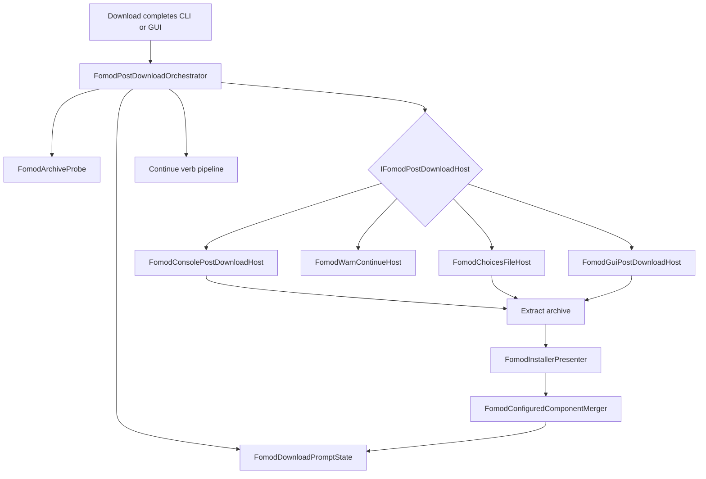

# Plan 123 — CLI FOMOD post-download prompts

## Summary

Unify post-download FOMOD configuration in Core, move the headless wizard presenter into `ModSync.Core`, and wire CLI `install -d`, `convert -d`, and `merge -d` to the same orchestrator the GUI uses. Interactive terminals get the full step wizard; non-interactive runs warn-and-continue by default, with `--fomod-skip`, settings/env config, and optional `--fomod-choices` for agents. This slice also fixes hidden-step merge and re-configure merge correctness called out in review.

## Problem Frame

GUI users get optional FOMOD configuration after **Fetch Downloads**; CLI users running full-build `install -d` download the same archives but never configure installer options, breaking agent-action parity and producing different validation/install outcomes. The presenter and post-download loop currently live in the GUI assembly, blocking Core CLI integration.

(see origin: `docs/brainstorms/2026-06-14-fomod-cli-download-prompts-requirements.md`)

## Requirements

| ID | Requirement | Plan coverage |
|----|-------------|---------------|
| R1 | CLI post-download FOMOD scan on `install`/`convert`/`merge` `-d` | U3, U4 |
| R2 | Probe + `ShouldPrompt` gate | U2 |
| R3 | Selected components only | U2, U3 |
| R4 | TTY Yes/No; No → `MarkDismissed` | U4 |
| R5 | Full terminal wizard + merge + `MarkConfigured` | U4, U5 |
| R6 | Non-TTY default warn-continue, no dismiss | U4, U6 |
| R7 | `--fomod-skip` persists dismiss | U3, U6 |
| R8 | Config via env, CLI, settings | U3 |
| R9 | `--fomod-choices` for agents | U6 |
| R10 | Convert/merge output persists FOMOD state | U4 |
| R11 | Install in-memory only | U4 |
| R12 | Core orchestrator; GUI/CLI hosts | U1, U2, U7 |
| R13 | Presenter in Core | U1 |
| R14 | Hidden-step apply fix | U5 |
| R15 | Re-configure merge fix | U5 |

---

## Key Technical Decisions

### KTD-1: Core orchestrator + host adapters (not inline `ModBuildConverter` logic)

Mirror `InstallationValidationPipeline` + `ConfirmationCallback`: one `FomodPostDownloadOrchestrator` in Core; GUI and CLI supply `IFomodPostDownloadHost` implementations. **Reject** duplicating the loop inside `ModBuildConverter` (~3.5k lines).

### KTD-2: Move `FomodInstallerPresenter` to Core

Presenter is already headless; GUI dialog becomes a view. Enables CLI wizard and removes `ModSync.Tests` → GUI dependency for presenter tests.

### KTD-3: Per-verb hook placement (not inside `DownloadAllModFilesAsync` alone)

| Verb | Hook after download | Component filter | Persist |
|------|---------------------|------------------|---------|
| `install -d` | ~L3058, before validation | `IsSelected` | No |
| `convert -d` | ~L1906, before autogen/serialize | `IsSelected` after `ApplySelectionFilters` if `-s`/`--select` used; else all loaded components that remain selected | Yes when `-o` |
| `merge -d` | ~L2438, before serialize | All (merge sets `IsSelected=true`) | Yes when output set |

Convert runs selection filters **after** download today; FOMOD hook for convert must run **after** `ApplySelectionFilters` (~L2025) when building the scan list, or immediately before serialize with the same filtered list.

### KTD-4: TTY and mode resolution

```
FomodPostDownloadMode resolved by:
  1. --fomod-skip / --fomod-choices (mutually exclusive with interactive prompt path)
  2. KOTOR_MODSYNC_FOMOD_MODE env
  3. settings.json fomodPostDownloadMode
  4. If interactive TTY (see KTD-5) → Interactive
  5. Else → WarnContinue
```

Add `FomodPostDownloadMode` enum: `Interactive`, `WarnContinue` (v1); reserve `Block`, `AutoDismiss` for future settings values without schema break.

### KTD-5: Interactive TTY detection

Single helper `ConsoleInteractionCapabilities` (Core.CLI):

- `IsInteractivePromptAvailable` = `!forceNonInteractive && !Console.IsInputRedirected && (!Console.IsOutputRedirected || allowOutputRedirect) && Environment.UserInteractive != false`
- Honor `CI`/`GITHUB_ACTIONS` as non-interactive unless `--interactive`
- Reuse patterns from `ConsoleProgressDisplay` but **do not** share render lock with progress UI during wizard

### KTD-6: Console wizard implementation

Add **Spectre.Console** package to `ModSync.Core` (netstandard2.0+ compatible) behind `FomodConsoleWizard` using injected `IAnsiConsole` for testability. Map `FomodGroupType` → `SelectionPrompt` / `MultiSelectionPrompt` per best-practices research. Fallback plain-text path when `TERM=dumb` or `--plain-text`.

### KTD-7: Hidden-step apply fix (R14)

Change `ApplySelectionsToComponent` to apply only plugins belonging to **currently visible** steps (recompute `GetVisibleStepIndices` at finish). Add regression test mirroring flag-dependent visibility scenario from `FomodInstallerPresenterTests`.

### KTD-8: Re-configure merge (R15)

Extend `FomodConfiguredComponentMerger` to update `Option.IsSelected` for matching GUIDs and remove/replace prior FOMOD-sourced instructions (tagged via source metadata or replace-all instructions from configured component when merging post-download). Narrow scope: only instructions added by FOMOD mapper (detectable by Choose/Copy patterns from mapper) to avoid wiping hand-authored instructions.

### KTD-9: ResourceRegistry mutation discipline

Orchestrator and download code must never assign through `ResourceRegistry` getter copy. Use in-place `HandlerMetadata` mutation on resolved `ResourceMetadata` references only; add `ModComponent` internal helper if needed for archive→resource lookup.

### KTD-10: Agent choices file

JSON sidecar v1 schema (stable names, not indices):

```json
{
  "version": 1,
  "archives": [
    {
      "archiveFileName": "ExampleMod.zip",
      "selections": [
        { "stepName": "Main", "groupName": "Quality", "plugins": ["High"] }
      ]
    }
  ]
}
```

`FomodChoicesFileHost` applies selections programmatically via presenter API without terminal I/O.

---

## High-Level Technical Design



---

## Scope Boundaries

**In scope:** This plan's R1–R15, KB/agent-parity updates, tests listed per unit.

### Deferred to Follow-Up Work

- CLI download only fetches `IsSelected` components (`DownloadAllModFilesAsync` behavior change).
- `--save-instruction-file` on `install -d` after FOMOD.
- `fomod configure` standalone CLI verb (re-run wizard on existing archive).
- Plugin images in terminal UI.
- Validation gate blocking install when FOMOD unset.

**Out of scope:** MCP-in-app tools; widescreen wizard.

---

## Risks and Dependencies

| Risk | Mitigation |
|------|------------|
| ResourceRegistry copy drops metadata (C1) | KTD-9; P0 serialization test |
| Hidden-step stale selections (C3) | KTD-7; presenter test |
| Non-TTY infinite re-warn (C4) | Document; `--fomod-skip` persists; choices file for CI |
| Dual settings serializers | Same JSON keys in `SettingsData` + `AppSettings`; round-trip test |
| Spectre.Console on net48 | Verify package TFM; plain-text fallback |
| Concurrent download + FOMOD hook race | Run FOMOD orchestrator **after** full download batch completes (current hook design) |

**Depends on:** PR #169 merged or cherry-picked Core FOMOD probe/state/merger.

---

## Implementation Units

### U1. Move presenter and session models to Core

**Goal:** Headless FOMOD wizard logic is consumable from CLI without GUI reference.

**Requirements:** R13

**Files:**

- Move `src/ModSync.GUI/Services/FomodInstallerPresenter.cs` → `src/ModSync.Core/Services/Fomod/FomodInstallerPresenter.cs`
- Move session model types to `src/ModSync.Core/Services/Fomod/FomodInstallerSessionModels.cs` (or same folder)
- Update `src/ModSync.GUI/Dialogs/FomodInstallerDialog.axaml.cs`
- Update `src/ModSync.Tests/FomodInstallerPresenterTests.cs`

**Approach:** Namespace `ModSync.Core.Services.Fomod`. GUI project adds no logic—update usings only.

**Test scenarios:**

- Happy path: existing `FomodInstallerPresenterTests` pass unchanged after namespace move.
- Build: `ModSync.Core` builds without GUI reference.

**Verification:** `dotnet test --filter FullyQualifiedName~FomodInstallerPresenterTests`

---

### U2. Core orchestrator and extract helper

**Goal:** Single post-download FOMOD loop shared by GUI and CLI.

**Requirements:** R1, R2, R3, R12

**Dependencies:** U1

**Files:**

- `src/ModSync.Core/Services/Fomod/FomodPostDownloadOrchestrator.cs` (new)
- `src/ModSync.Core/Services/Fomod/IFomodPostDownloadHost.cs` (new)
- `src/ModSync.Core/Services/Fomod/FomodPromptContext.cs` (new)
- `src/ModSync.Core/Services/Fomod/FomodArchiveExtractService.cs` (new — lift from GUI service)
- `src/ModSync.Tests/FomodPostDownloadOrchestratorTests.cs` (new)

**Approach:**

- Port `GetDownloadedArchivePaths` logic into orchestrator (or shared static helper).
- Loop: selected components → archives → probe → `ShouldPrompt` → host.AskConfigure → extract → parse/map → host.RunWizard → merge → mark state.
- Fake host in tests records decisions without I/O.

**Test scenarios:**

- Happy path: probe positive → host Configure → merge updates `Options` → `MarkConfigured`.
- Dismiss path: host Dismiss → `MarkDismissed`, no merge.
- Skip prompt when `ShouldPrompt` false.
- Selected-only: deselected component with FOMOD archive on disk is not scanned.
- Extract failure: host notified; no `MarkConfigured`.
- Multi-archive: two zips on one component, independent state keys.

**Verification:** New test class green; no Avalonia reference in test project for orchestrator tests.

---

### U3. Config resolution and CLI flags

**Goal:** Global FOMOD post-download mode via CLI, env, and settings.

**Requirements:** R7, R8

**Dependencies:** U2

**Files:**

- `src/ModSync.Core/Services/Fomod/FomodPostDownloadOptions.cs` (new)
- `src/ModSync.Core/Services/Fomod/FomodPostDownloadOptionsResolver.cs` (new)
- `src/ModSync.Core/CLI/ModBuildConverter.cs` (add `--fomod-skip`, `--fomod-choices`, `--fomod-non-interactive` to shared options)
- `src/ModSync.GUI/Models/AppSettings.cs` (add `FomodPostDownloadMode` string, default `warn-continue`)
- `src/ModSync.GUI/Dialogs/SettingsDialog.cs` (expose setting in Downloads or Advanced section)
- `src/ModSync.Tests/FomodPostDownloadOptionsResolverTests.cs` (new)

**Approach:** Precedence per KTD-4. CLI `SettingsData` mirrors GUI key `fomodPostDownloadMode`.

**Test scenarios:**

- CLI flag overrides env overrides settings.
- Default mode when no config and non-TTY is `WarnContinue`.
- `--fomod-skip` forces skip semantics for session.

**Verification:** Resolver unit tests.

---

### U4. CLI hosts and `ModBuildConverter` hooks

**Goal:** Wire install/convert/merge download completion to orchestrator with correct hosts.

**Requirements:** R4–R6, R10, R11

**Dependencies:** U2, U3

**Files:**

- `src/ModSync.Core/CLI/ConsoleInteractionCapabilities.cs` (new)
- `src/ModSync.Core/CLI/FomodWarnContinuePostDownloadHost.cs` (new)
- `src/ModSync.Core/CLI/FomodConsolePostDownloadHost.cs` (new)
- `src/ModSync.Core/CLI/ModBuildConverter.cs` (three hook call sites)
- `src/ModSync.Tests/FomodCliPostDownloadTests.cs` (new)

**Approach:**

- Factory selects host from resolved options + TTY capabilities.
- `install -d`: orchestrator after download, before validation; selected components.
- `convert -d`: orchestrator after `ApplySelectionFilters`, before serialize; persist via existing output path.
- `merge -d`: same as convert.
- Warn host logs: `WARN: FOMOD installer detected in '{archive}' for mod '{name}'. Configure later via GUI or re-run with --fomod-choices.`

**Test scenarios:**

- Redirected stdin: no hang; WARN emitted; exit continues.
- `--fomod-skip` + convert `-o`: dismissed state in output TOML.
- TTY fake: Yes → wizard host invoked (mock console).
- Install path: no file write after FOMOD; in-memory options changed.

**Verification:** `FomodCliPostDownloadTests` + manual `install -d` smoke on desktop.

---

### U5. Console wizard + presenter correctness fixes

**Goal:** Full terminal wizard and fix hidden-step / re-configure merge bugs.

**Requirements:** R5, R14, R15

**Dependencies:** U1, U4

**Files:**

- `src/ModSync.Core/CLI/FomodConsoleWizard.cs` (new)
- Add Spectre.Console to `src/ModSync.Core/ModSync.Core.csproj` (if TFM compatible)
- `src/ModSync.Core/Services/Fomod/FomodInstallerPresenter.cs` (KTD-7 apply visible-only)
- `src/ModSync.Core/Services/Fomod/FomodConfiguredComponentMerger.cs` (KTD-8)
- `src/ModSync.Tests/FomodInstallerPresenterTests.cs` (hidden-step regression)
- `src/ModSync.Tests/FomodConfiguredComponentMergerTests.cs` (new)

**Approach:**

- Console wizard loop matches `FomodInstallerDialog` Next/Finish: recompute visible indices after each selection; validate each visible step before advance.
- Merger: upsert options by GUID; strip prior FOMOD-generated instructions before append (use heuristic: instructions referencing `<<modDirectory>>` paths under extracted folder name, or add `Instruction.SourceMetadata` tag in mapper—plan defers exact tag to implementation discovery).

**Test scenarios:**

- Hidden step: select high tier extras, go back, select low tier, finish → extras not applied.
- Re-configure: second merge updates `IsSelected`, does not duplicate Choose instructions.
- Console wizard integration: mock `IAnsiConsole` selects plugins; session validates.

**Verification:** Presenter + merger tests; optional Spectre `TestConsole` snapshot.

---

### U6. FOMOD choices file host (agent path)

**Goal:** Cloud agents configure FOMOD without TTY.

**Requirements:** R9

**Dependencies:** U2, U5

**Files:**

- `src/ModSync.Core/Services/Fomod/FomodChoicesFile.cs` (new model)
- `src/ModSync.Core/Services/Fomod/FomodChoicesFileHost.cs` (new)
- `src/ModSync.Core/Services/Fomod/FomodChoicesApplier.cs` (new — drives presenter without UI)
- `src/ModSync.Tests/FomodChoicesFileTests.cs` (new)
- `docs/knowledgebase/core-cli-reference.md` (document flags)

**Test scenarios:**

- Valid choices file → `MarkConfigured`, options merged.
- Missing plugin name → actionable error listing valid plugins.
- Choices + `--fomod-skip` → skip wins (documented).

**Verification:** Unit tests; example JSON in test fixtures.

---

### U7. GUI adapter refactor

**Goal:** GUI download hook delegates to Core orchestrator; behavior unchanged for users.

**Requirements:** R12

**Dependencies:** U2

**Files:**

- `src/ModSync.GUI/Services/FomodGuiPostDownloadHost.cs` (new)
- `src/ModSync.GUI/Services/FomodPostDownloadPromptService.cs` (thin wrapper)
- `src/ModSync.GUI/Services/DownloadOrchestrationService.cs` (unchanged call site)

**Approach:** GUI host implements `AskConfigure` via `ConfirmationDialog`; `RunWizard` via `FomodInstallerDialog`.

**Test scenarios:**

- Test expectation: none — manual desktop validation per `AGENTS.md`; optional headless test with fake host already in U2.

**Verification:** Desktop Fetch Downloads → FOMOD prompt still appears.

---

### U8. Docs, KB, and agent-native parity

**Goal:** Document CLI FOMOD paths; upgrade parity tables.

**Requirements:** Success criteria

**Dependencies:** U4, U6

**Files:**

- `docs/knowledgebase/fomod-support.md`
- `docs/knowledgebase/agent-action-parity.md`
- `docs/knowledgebase/download-system.md`
- `docs/plans/vortex-mo2-feature-parity-living-plan.md`
- `docs/knowledgebase/agent-native-audit.md` (FOMOD parity row)

**Test scenarios:**

- Test expectation: none — doc accuracy review against implemented flags.

**Verification:** Links and flag names match `ModBuildConverter` help text.

---

## Verification Strategy

```bash
dotnet build ModSync.sln --configuration Debug
dotnet test src/ModSync.Tests/ModSync.Tests.csproj \
  --filter "FullyQualifiedName~Fomod" --configuration Debug
dotnet test src/ModSync.Tests/ModSync.Tests.csproj \
  --filter "FullyQualifiedName~FomodCliPostDownload" --configuration Debug
```

Manual (desktop): `./scripts/agents/launch_gui_desktop.sh` — Fetch Downloads with FOMOD fixture; confirm prompt.

Manual (TTY): `dotnet run --project src/KOTORModSync.Core/KOTORModSync.Core.csproj -- install -d ...` with minimal FOMOD zip fixture.

---

## Open Questions (implementation-time)

- Exact instruction tagging for safe re-configure merge (KTD-8) — resolve during U5 by inspecting `FomodToComponentMapper` output shapes.
- Whether `install -y` should suppress FOMOD Yes/No but still allow wizard when user passes `--fomod-choices` (default: `-y` skips confirmation prompts only, not FOMOD wizard unless `--fomod-skip`).

---

## Sources and Research

- Repo research: Core hook points, settings dual-schema, test templates (`ModBuildConverterCliIntegrationTests`)
- Architecture: orchestrator + host pattern (validation pipeline precedent)
- Best practices: Spectre.Console + `IAnsiConsole`, non-interactive-first flags, choices JSON by name
- Feasibility: presenter move mandatory; no GUI reference from Core
- Correctness review: C1–C10 ranked risks embedded in KTD-7–9 and unit tests
